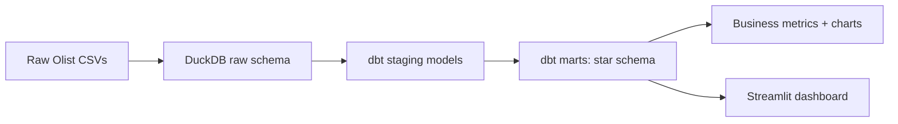

<div align="center">

# 📊 Olist Analytics Engineering — dbt + DuckDB

**A real e-commerce warehouse: raw ingestion, a tested dbt star schema, business KPI exports, and an interactive Streamlit dashboard.**

[](.github/workflows/ci.yml)
[](pyproject.toml)
[](dbt/dbt_project.yml)
[](configs/config.yaml)
[](dashboard/app.py)
[](docker/Dockerfile)
[](LICENSE)

</div>

---

## Overview

Every e-commerce business runs on the same underlying question: what's actually selling, to whom, and how well is it being delivered? Answering that reliably requires more than a few ad-hoc queries — it needs a tested, documented, version-controlled transformation layer that a whole team can trust. This repository builds exactly that: a real 99,441-order e-commerce dataset, ingested and modeled with **dbt** into a star schema on **DuckDB**, with 34 automated data tests, headline KPI exports, and a self-serve Streamlit dashboard.

## Business problem

| | |
|---|---|
| **Who faces it** | Any company with an operational database (orders, payments, deliveries) that needs to become a trustworthy analytics warehouse |
| **Why it matters** | Untested, undocumented SQL scattered across notebooks and BI tool queries drifts out of sync with reality and nobody notices until a number is wrong in front of a stakeholder |
| **Current industry approach** | Analytics engineering with dbt: staging → marts layering, tests as code, docs as code, reviewed like software |
| **Where this project fits** | A complete, working instance of that pattern on real order/item/payment/customer data, including a genuine data-quality finding surfaced and triaged rather than hidden |

## Architecture



Full architecture, the star schema ERD, and the real data-quality finding: **[docs/architecture.md](docs/architecture.md)**.

## Project structure

```
olist-analytics-engineering/
├── src/                      # ingest, load_raw, export_metrics, config, logger
├── dbt/
│   ├── models/staging/       # 1:1 cleaned views over raw tables
│   ├── models/marts/         # star schema: dims, fact, and aggregate marts
│   ├── tests/                # custom singular data-quality tests
│   └── macros/               # generate_schema_name override
├── dashboard/app.py          # Streamlit KPI dashboard
├── tests/                    # pytest: ingestion, mart invariants, metrics export
├── configs/config.yaml       # Single source of truth for paths & table names
├── data/                     # Ingested raw CSVs (+ README documenting provenance/license)
├── artifacts/                # warehouse.duckdb, business_metrics.json, charts
├── docker/Dockerfile         # Builds the full warehouse at image build time
├── docker-compose.yml
├── .github/workflows/ci.yml
├── docs/architecture.md      # Mermaid architecture + ERD diagrams
├── Makefile
├── pyproject.toml
└── requirements.txt
```

## Dataset

**Real**, not synthetic: the "Brazilian E-Commerce Public Dataset by Olist" — 99,441 real, anonymized orders from 2016–2018 across 6 tables (orders, order items, customers, products, payments, category translations). **CC BY-NC-SA 4.0 — non-commercial use**; this is a portfolio/educational project, consistent with that license. Full provenance, table descriptions, and citation: **[data/README.md](data/README.md)**.

## The warehouse

`dbt build` runs 7 table models (2 dims, 1 fact, 3 aggregate marts, plus the raw→staging views) and **34 automated data tests** (uniqueness, not-null, accepted values, referential integrity, and 2 custom singular tests) — all passing, one intentional warning. See [docs/architecture.md](docs/architecture.md) for why one test is a warning rather than a hard failure: it caught a genuine, small data-quality quirk in the real upstream data (8 of 99,441 orders marked "delivered" with no delivery timestamp) and the project documents and triages it rather than hiding it.

## Business insights (computed directly from the marts)

| Metric | Value |
|---|---|
| Total revenue (delivered orders, 2016–2018) | R$ 15,419,773.75 |
| Total delivered orders | 96,478 |
| Average order value | R$ 159.83 |
| Top category by revenue | health_beauty (R$ 1,233,131.72) |
| Weighted avg. delivery time | 12.5 days |
| Weighted % late deliveries | 8.1% |
| Unique customers | 96,096 |

Full report: [artifacts/business_metrics.json](artifacts/business_metrics.json). Charts: [artifacts/monthly_revenue.png](artifacts/monthly_revenue.png), [artifacts/top_categories.png](artifacts/top_categories.png).

> These figures are independently consistent with publicly published analyses of the same dataset (~R$15.9M in total revenue is the commonly cited figure across several public write-ups of this data), which is a useful sanity check when you can't fully audit someone else's pipeline — the numbers should roughly agree with other people's honest analysis of the same public data.

## Installation & usage

```bash
git clone <YOUR_GITHUB_URL>
cd olist-analytics-engineering
python -m venv .venv && source .venv/bin/activate
make install     # pip install -r requirements.txt
make build        # ingest -> load raw -> dbt build (staging + marts + tests)
make metrics       # export business_metrics.json + charts
make test           # pytest with coverage
make dashboard        # runs the Streamlit dashboard at http://localhost:8501
```

You can also drive dbt directly:

```bash
dbt build --project-dir dbt --profiles-dir dbt
dbt docs generate --project-dir dbt --profiles-dir dbt && dbt docs serve --project-dir dbt --profiles-dir dbt
```

## Deployment (Docker)

```bash
docker compose up --build
```

The image ingests data and runs the full dbt build at image build time, so `docker run` serves the dashboard immediately.

> Note: the Dockerfile was validated by syntax/build-plan review in this build environment (no Docker daemon available in the sandbox); the underlying ingest → load → dbt build → export → `streamlit run` pipeline was verified end-to-end by running each step directly, including confirming the dashboard serves a 200 OK on its health endpoint. Please run `docker compose up --build` locally to confirm before deploying.

## Testing & CI

22 pytest tests (ingestion, raw-layer loading, mart business-logic invariants like "monthly revenue sums match an independently computed total", and metrics export) plus dbt's own 34 schema/data tests — all run automatically on every push via **[.github/workflows/ci.yml](.github/workflows/ci.yml)** across Python 3.10 and 3.11, followed by a Docker build job.

```bash
make test
```

## Dashboard

`streamlit run dashboard/app.py` serves an interactive view over the marts: headline KPIs, monthly revenue/order/AOV trends, a sortable top-categories table with an adjustable top-N slider, and delivery performance by state — the kind of self-serve tool an analytics engineering team hands to stakeholders instead of fielding one-off SQL requests.

## Future work

- Incremental models for `fct_order_items` instead of full-refresh table materialization, once the source supports true incremental extraction
- Add `dbt-expectations` or a similar package once package-hub network access is available, for richer test coverage (distribution checks, freshness)
- Wire in the reviews dataset for a customer-satisfaction mart (average review score by category/seller)
- Swap DuckDB for a warehouse like Snowflake/BigQuery — the dbt models themselves wouldn't need to change, only `profiles.yml`
- Add `dbt docs` generation to CI and publish it as a static site alongside the dashboard

## License

MIT for this repository's code — see [LICENSE](LICENSE). The dataset is CC BY-NC-SA 4.0 (non-commercial) licensed by its original publisher; see [data/README.md](data/README.md) for citation.

## Contact

**Muhammad Farooq Shafi**
📧 mfarooqsgafee333@gmail.com
💼 [LinkedIn](https://www.linkedin.com/in/muhammadfarooqshafi/)
📘 [Facebook](https://www.facebook.com/profile.php?id=61575167257313)
🔗 GitHub: `<YOUR_GITHUB_URL>`
