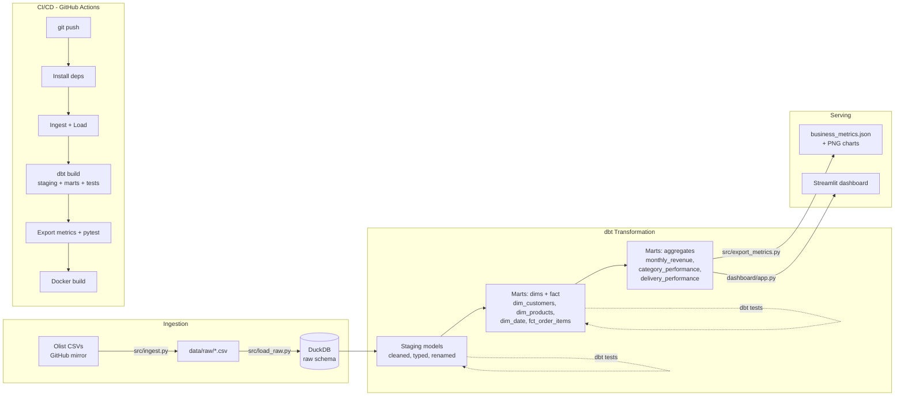
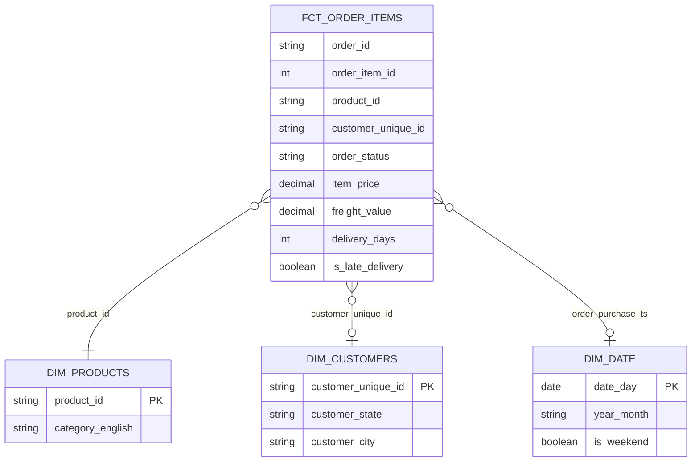

# Architecture

## System overview

## Star schema (marts layer)

`mart_monthly_revenue`, `mart_category_performance`, and
`mart_delivery_performance` are pre-aggregated rollups built directly on top
of `fct_order_items`, so a dashboard or BI tool never has to run an expensive
aggregation over the full fact table at query time.

## Why dbt + DuckDB

- **DuckDB** is a full SQL engine that runs in-process against a single file
  — no server to run, no credentials to manage, and fast enough to rebuild
  this entire warehouse (99k orders, 112k line items) from scratch in under
  3 seconds. It's increasingly common as the local/small-warehouse choice in
  the modern data stack, and the same dbt project would point at Snowflake,
  BigQuery, or Postgres with only a `profiles.yml` change — the SQL doesn't
  change.
- **dbt** enforces the staging → marts layering that keeps a warehouse
  maintainable: staging models do only light cleaning (renaming, casting),
  marts hold all business logic (joins, aggregations), and every model is
  tested and documented as code, reviewable in a pull request like any other
  software change.

## A real data-quality finding

`dbt build` includes a custom test asserting that every order marked
`delivered` has a delivery timestamp. Running it against the real data
surfaces **8 orders (out of 99,441, ~0.008%)** that violate this — a genuine
quirk in the upstream Olist data, not a bug in this pipeline. The test is
configured with `severity: warn` rather than `error`: it's visible in every
CI run without blocking the build, which is how a real data team triages a
small, well-understood, low-impact source anomaly rather than either
silently ignoring it or halting the pipeline over it. See
`dbt/tests/assert_delivered_orders_have_delivery_date.sql`.

## Design decisions

| Decision | Rationale |
|---|---|
| Raw layer loaded by plain Python/DuckDB, not dbt | Keeps ingestion (which changes based on the source system) decoupled from transformation (which dbt owns). A production version could swap this loader for Fivetran/Airbyte without touching a single dbt model. |
| No dbt package dependencies (dbt_utils, etc.) | This sandbox has no network access to the dbt package hub. `dim_date` is generated with DuckDB's native `generate_series` instead of `dbt_utils.date_spine`, documented inline as a deliberate substitution. |
| Payments aggregated to one row per order in staging | An order can have multiple payment rows (e.g. split across a voucher and a credit card); aggregating early avoids silently fanning out the fact table's grain when joined later. |
| AOV computed by first collapsing to one row per order | Multi-item orders would otherwise inflate the "order" count and understate average order value if computed directly on the item-grain fact table. |
| Revenue marts filter to `order_status = 'delivered'` | Matches how a business actually reports realized revenue, rather than including cancelled or unavailable orders' gross cart value. |
| Streamlit dashboard instead of a FastAPI endpoint | Analytics engineering deliverables are typically self-serve dashboards for stakeholders, not APIs for other services — a different, equally real serving paradigm from this series' other projects. |

## Data flow

1. `src/ingest.py` downloads the 6 real Olist CSVs from a GitHub mirror.
2. `src/load_raw.py` loads each into a DuckDB table under the `raw` schema.
3. `dbt build` (staging → marts, with tests) transforms raw data into a
   star schema and pre-aggregated business marts.
4. `src/export_metrics.py` computes headline KPIs and saves charts directly
   from the marts.
5. `dashboard/app.py` (Streamlit) queries the marts live for an interactive
   view.
